<p align="center">
  
</p>

<p align="center">
  <b>English</b> · <a href="README.ru.md">Русский</a>
</p>

<p align="center">
  <a href="https://github.com/renf0x/obscura/actions/workflows/hub.yml"></a>
  <a href="https://github.com/renf0x/obscura/actions/workflows/app.yml"></a>
  <a href="LICENSE"></a>
</p>

```text
SUBJECT ........ Obscura
TYPE ........... open-source camera system: hub + Android/iOS app
CAMERAS ........ any RTSP or ONVIF camera, TP-Link Tapo included
CLOUD .......... optional, your own
SUBSCRIPTION ... none
```

## Briefing

Obscura is an open-source home camera system. The goal is a convenient setup that belongs entirely to you
and replaces vendor services that keep your recordings, and some features, behind a paid cloud subscription.

Everything runs on your own server. The cameras never reach the internet; only the hub talks to them. When
something moves in a zone or a person walks in, the hub records a short clip, sends an alert to your phone,
and stores the footage where you tell it to: on the hub, in S3, on a WebDAV share, or in any cloud rclone
supports.

## Equipment

- **Live view** from anywhere. The phone connects to the hub, never to the camera.
- **Zones on the image.** Draw the areas you care about and pick what each one reacts to: motion, people,
  or both. People are recognized by a YOLOX-nano model running on the hub.
- **Clips, not 24/7 footage**: 4 seconds before the event and up to 40 after.
- **Storage you choose.** Clips stay on the hub and can be copied to S3, WebDAV (Nextcloud, Yandex Disk) or
  any [rclone](https://rclone.org) backend: Google Drive, Dropbox, OneDrive, encrypted remotes included.
- **Two alert sounds**: a loud trill for a person, a soft chime for motion. Android gets alerts through
  [UnifiedPush](https://unifiedpush.org), without Google services, encrypted from the hub to the phone.
- **Talk and siren**, if the camera has a speaker. Hold the button, speak, and the camera plays it back.
  The siren goes off on demand or when a person is detected. Which cameras support this is covered under
  [Cameras](#cameras).
- **Setup guides in the app**, in English and Russian: server, cameras, remote access, cloud, notifications.

## How it works

```text
 Camera ──RTSP──▶ Hub (your server) ──HTTPS / Tailscale──▶ Phone
                   │  go2rtc: one connection per camera
                   │  motion + person (YOLOX-nano) inside zones
                   │  ffmpeg ring buffer → clips
                   └─ rclone ──▶ S3 / WebDAV / Google Drive …
```

| Part | Stack |
|------|-------|
| `hub/` | Python 3.12, FastAPI, OpenCV, onnxruntime (YOLOX-nano), ffmpeg, rclone, SQLite |
| `deploy/` | Docker Compose (hub + [go2rtc](https://github.com/AlexxIT/go2rtc)) or a systemd install script |
| `app/` | Flutter (Android, iOS), media_kit player |

## Deployment

There are two ways to install. Both end with a pairing code that you enter in the app, one code per phone.

### Option A: a computer at home, with Docker

Any 64-bit Linux machine works. A Raspberry Pi 4 (2 GB) handles one or two cameras; an Intel N100 mini PC
handles up to ten.

```sh
curl -fsSL https://get.docker.com | sh        # skip if Docker is already installed
git clone https://github.com/renf0x/obscura
cd obscura/deploy
mkdir -p data && sudo chown -R 1000:1000 data
docker compose up -d --build
docker compose logs hub | grep -i pairing      # one-time pairing code
```

Set your time zone in `deploy/docker-compose.yml` (`TZ`) before the first start, or schedules and clip
dates will be off. A code for another phone: `docker compose exec hub python -m obscura pair`.

### Option B: a Debian or Ubuntu server, no Docker

For a VPS or a home server you want to reach over HTTPS.

```sh
git clone https://github.com/renf0x/obscura
cd obscura/deploy
sudo ./install.sh                  # or with your own domain: sudo ./install.sh cam.example.com
```

The script installs the hub and go2rtc as systemd services that listen on localhost only. Caddy sits in
front and gets the HTTPS certificate on its own. Without a domain the script uses `<your-ip>.sslip.io`.
In ufw it opens only ports 80 and 443 and leaves other firewall rules, VPN and SSH alone.

At the end the script shows a QR code. Open the app, tap **Scan QR Code**, and the phone connects. For
another phone, run `obscura-pair`.

The hub has to see the cameras: either they share a network with the server, or the server has a tunnel
into your home network. Running the script again updates the hub and keeps the data in `/opt/obscura/data`.

### The phone

Get the APK from [Releases](https://github.com/renf0x/obscura/releases) or build it with
`cd app && flutter build apk --release`. On first launch enter the hub address and the code (for option A
the address looks like `HUB_IP:7878`), or scan the QR code from option B.

### Cameras

Obscura was tested with TP-Link Tapo cameras, so they get a step-by-step guide below. Other cameras connect
the same way, but we haven't verified specific models.

**TP-Link Tapo**

1. Set the camera up on Wi-Fi in the Tapo app and update its firmware.
2. In the Tapo app open the camera → Settings → Advanced Settings → Camera Account and choose a username and
   password (6–32 characters). This is not your TP-Link ID; it's a separate local login for the video stream.
3. If the settings have a "Third-Party Compatibility" option (sometimes under Tapo Lab), turn it on. Newer
   firmware may block RTSP without it.
4. Find the camera's IP under Settings → Device Info. Reserve that address for the camera in your router so
   it doesn't change.
5. In Obscura: Cameras → Add Camera → TP-Link Tapo, then the IP and the login from step 2. "Find cameras on the network"
   locates the camera for you when the hub is on the same network.
6. For talk and siren, enter your TP-Link account password (the one you use in the Tapo app) in the camera's
   connection settings. The hub stores only its hash, never the password. On Tapo the siren is the camera's
   own alarm, sound and light.

**Other cameras**

Any camera that streams over RTSP or ONVIF should work. For Hikvision, Dahua/Imou and Reolink the app fills
in the stream paths. For others, look the path up in the manual or at
[ispyconnect.com/cameras](https://www.ispyconnect.com/cameras). Some vendors ship RTSP turned off or behind
a separate login, the way Tapo does, so check the camera's settings. Cloud-only cameras without RTSP (some
Xiaomi, Ring, Arlo) can't be connected.

Talk and siren work if the camera has a speaker and supports two-way audio over RTSP/ONVIF (Profile T) with
the G.711A codec. Most Hikvision, Dahua and Reolink models with a speaker do. Turn on "Camera has a speaker"
in the connection settings; the siren then plays a loud tone through the speaker.

### Away from home

With option A, install [Tailscale](https://tailscale.com) on the hub and the phone and connect to the hub's
Tailscale address. No router ports to open. With option B the hub is already reachable over HTTPS.

Each step has a longer walkthrough in the app: *Settings → Setup Guides*.

## Development

```sh
# hub
cd hub && python -m venv .venv && . .venv/bin/activate
pip install -r requirements-dev.txt && pytest

# app
cd app && flutter pub get && flutter analyze && flutter test
flutter run
```

Real cameras need `ffmpeg` on PATH and a running go2rtc. The tests run on fakes.

## Security

Found a vulnerability? Report it through GitHub: **Security** tab → **Report a vulnerability**. Only the
maintainer sees these reports, so the problem can be fixed before it becomes public. How Obscura protects
access, passwords and recordings is described in [SECURITY.md](SECURITY.md).

## License

[MIT](LICENSE). Components keep their own licenses: YOLOX (Apache-2.0), go2rtc (MIT), rclone (MIT),
ffmpeg (LGPL/GPL, run as a separate program).
